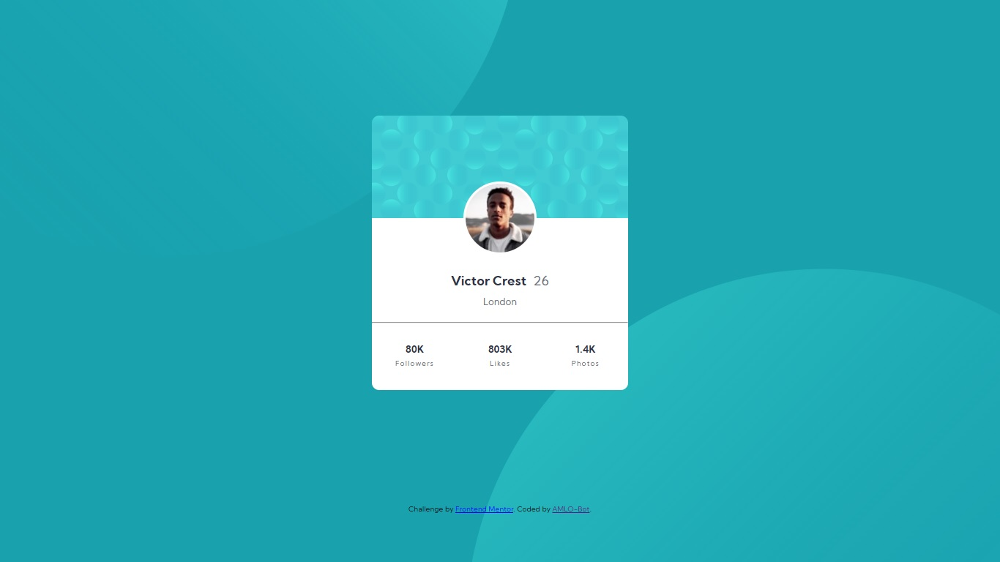

# Frontend Mentor - Profile card component solution

This is a solution to the [Profile card component challenge on Frontend Mentor](https://www.frontendmentor.io/challenges/profile-card-component-cfArpWshJ). Frontend Mentor challenges help you improve your coding skills by building realistic projects. 

## Table of contents

- [Overview](#overview)
  - [The challenge](#the-challenge)
  - [Screenshot](#screenshot)
  - [Links](#links)
- [My process](#my-process)
  - [Built with](#built-with)
  - [What I learned](#what-i-learned)
  - [Continued development](#continued-development)
  - [Useful resources](#useful-resources)
- [Author](#author)
- [Acknowledgments](#acknowledgments)

## Overview

### The challenge

- Build out the project to the designs provided

### Screenshot
- THIS IS MY SOLUTION !!

### Links

- Solution URL: [Repo in GitHub](https://github.com/AMLO-Bot/prof-card-frontend-masters)
- Live Site URL: [Vercel Deployment](https://profile-card-component-sigma-lake.vercel.app/)

## My process

- First design HTML markup, I identify  three parts in the card, the the cover background, the profile picture, and the information.
- Check if any alement change in size when displayed in larger devices and start defining media queries.
- Set all custom properties for colors, sizes, weigths and all that.
- Start adding styles using BEM from the outter element to the inner parts of the card.

### Built with

- Semantic HTML5 markup
- CSS custom properties
- Flexbox
- Mobile-first workflow

### What I learned

- Position elements in layouts
- Set several graphics as background images
- Use of BEM for CSS arquitecture
- Media Query to reposition bg images

### Continued development

- I would love to refine the application of BEM in future projects, and try different approaches to design reusable and mantainable CSS, and apply all of this with a preprocessor to agilize development.

### Useful resources

- [MDN Docs](https://developer.mozilla.org/es/docs/Web/CSS/background) - Good ol MDN. Taugth me about background property.
- [CSS Tricks](https://css-tricks.com/snippets/css/a-guide-to-flexbox/) - You may find everything about flexbox here, REMEMBER, to center an alement display: flex; justify- content: center; align-items: center; 😁😁

## Author

- Website - [Aldair Avalos](https://github.com/AMLO-Bot)
- Frontend Mentor - [@AMLO-Bot](https://www.frontendmentor.io/profile/AMLO-Bot)
- Twitter - [@AldairAvalos8](https://twitter.com/AldairAvalos8)
